# Global Conflict Analysis
*This document was ported from the original source file*

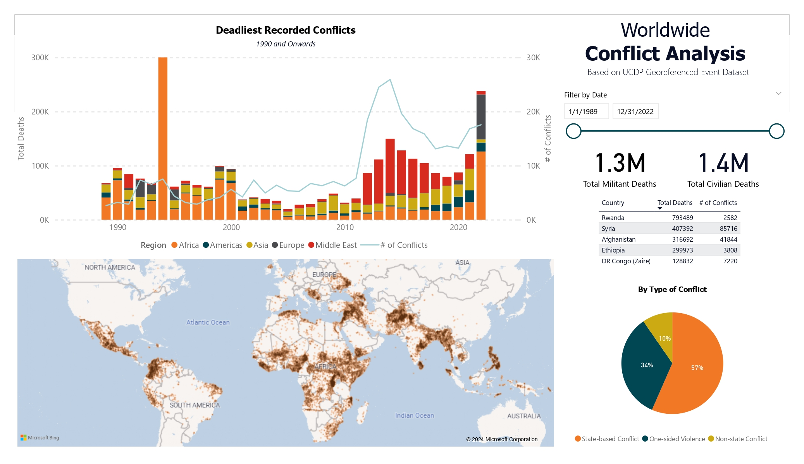
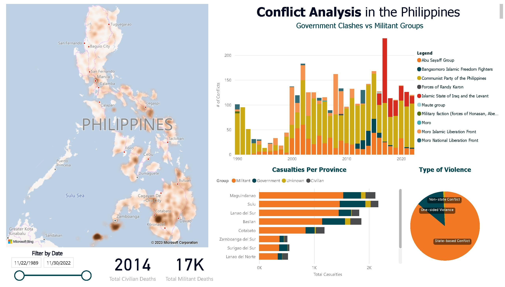

## Problem Statement

Despite the prevalence of global conflict events, there is a significant lack of awareness among the public due to the limited coverage of these events in mainstream media. The UCDP Georeferenced Event Dataset (GED) Global serves as a comprehensive source of information on organized violence and conflict events worldwide. However, the dataset and its visualizations struggle to reach the mainstream media, hindering the dissemination of crucial insights and preventing the broader public from understanding the scale and impact of global conflicts.

Not being aware of global conflict events has multiple negative consequences. To begin with, it hampers the public's understanding of the global political landscape, which in turn prevents informed decision-making and engagement in conflict resolution efforts. Additionally, the lack of media coverage creates a sense of isolation and disconnection from the experiences of affected communities, making it difficult to empathize and support humanitarian initiatives. Lastly, the absence of widespread awareness makes it challenging to mobilize resources and attention toward conflict-affected regions, resulting in an ineffective response and a lack of assistance.

There is a pressing need to address this issue and bridge the gap between the UCDP GED Global dataset and mainstream media. By creating awareness about global conflict events through effective visualizations and targeted dissemination strategies, we can enhance public understanding, foster empathy, and promote engagement in efforts aimed at conflict resolution and humanitarian support.

## Data Source

UCDP Georeferenced Event Dataset (GED) is a comprehensive collection of data on organized violence and conflict events worldwide. The GED is produced and maintained by the Uppsala Conflict Data Program (UCDP), a research project based at Uppsala University in Sweden.

The GED provides detailed information on various types of political violence, including armed conflict, riots, protests, and other forms of collective violence. It includes data on the location, time, actors involved, and the nature of the events. The dataset aims to provide reliable and standardized information to researchers, policymakers, and organizations working in the field of conflict analysis and resolution.

The data is available in CSV, Excel, R, or Stata. For this capstone project, only the CSV is used.

The schema for the data source can be found at [Appendix 1: Original Schema](#appendix-i-original-schema).

## Cleaning Data

This capstone project involves a lot of data cleaning in order to make data easy to understand for downstream users (i.e. data analysts) as well as improving overall data quality. Note that I didn’t use OpenRefine in this project as PowerQuery (built-in PowerBI feature) already has the full data cleaning functionality.

### Original Data Source

The data source has a lot of columns. I only showed some of it.
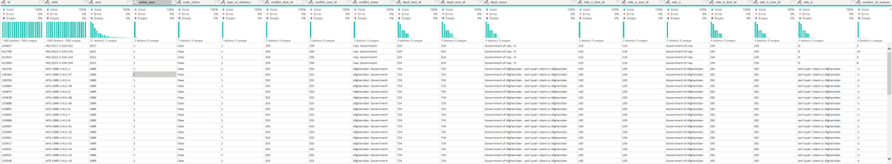
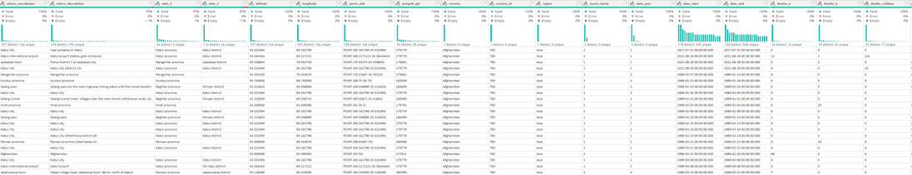

### Dropping Unnecessary Columns

The following columns were dropped: "conflict_dset_id", "conflict_new_id", "dyad_dset_id", "dyad_new_id", "side_a_dset_id", "side_a_new_id", "side_b_dset_id", "side_b_new_id", "geom_wkt", "priogrid_gid", "country_id", "dyad_name", "code_status", "gwnoa", "gwnob", "", "relid".

### Changing Data Types

- id: String to Int64
- year: String to Int64
- date_start: String to datetime
- date_end: String to datetime
- longitude and latitude: String to number
- deaths_a, deaths_b, deaths_unknown, deaths_civilians: String to Int64

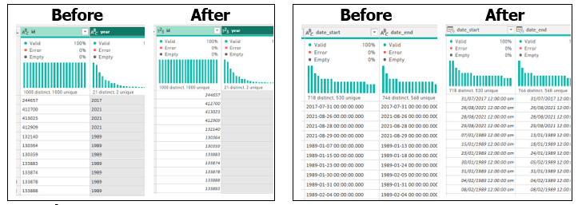

### Denormalizing Data

Some columns are normalized and use foreign keys. The following values were mapped using String replacement.

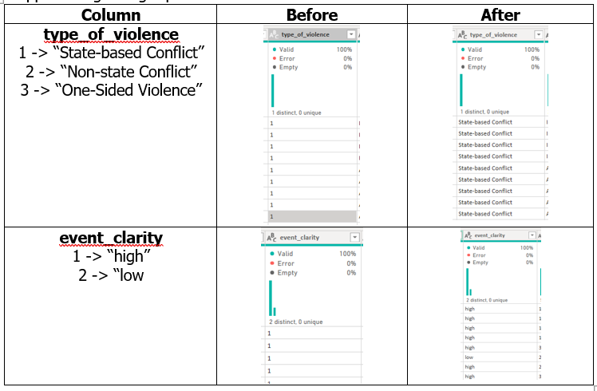

### Adding Columns

#### Column: Militant_deaths

deaths_a + deaths_b

#### Column: Total_deaths

deaths_a + deaths_b + deaths_unknown + deaths_civilians

### Cleaning Redundant Column Values

For this step, only the “side_b” column is replaced since it is part of the analysis. For militant groups, values with similar namings (such as MNLF – NM and MNLF – HM) were replaced with its parent organization (MNLF). Individual militants were replaced with their parent organization.

Before | After
--- | ---
 | 

Abbreviated names are replaced with their full names.

Before | After
--- | ---
 | 

Removed “province” and “municipality” in all values in “adm_1” and “adm_2” columns, respectively.

Before | After
--- | ---
 | 

### Cleaned Dataset

The following screenshots show the clean dataset.

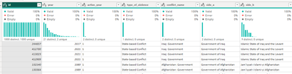
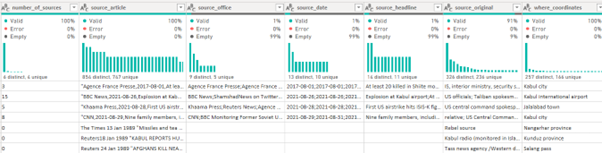
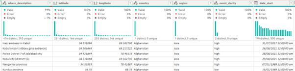
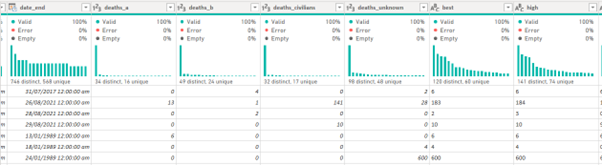
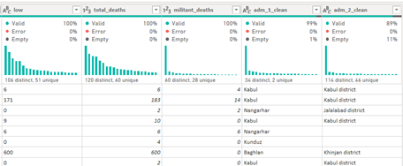

## Data Visualization

After cleaning the data, PowerBI is used to create visualizations. In this capstone project, there are two visualizations: international and local (Philippines). Both visualizations allow filtering of data by date range as well as KPI metrics showing civilian and militant deaths.

### International Conflict Analysis

- Contains the deadliest recorded conflicts over the course of time.
- Global map on where conflicts occur.
- Pie chart containing occurrences of conflicts per continent.
- Table containing most affected countries.
- Table shows the most common types of conflict in a period of time.

### Philippine Conflict Analysis

- Philippine map on where conflicts occur.
- Number of casualties per year and whose militant groups are responsible.
- Pie chart containing common types of violence.
- Total casualties per province.

Feel free to download the PowerBI file using this link: [PowerBI File](https://drive.google.com/file/d/1phSKJrN3onuuFdGx-qR51U4dGSBi0FJT/view?usp=sharing)

## References

- Davies, Shawn, Therese Pettersson & Magnus Öberg (2023). Organized violence 1989-2022 and the return of conflicts between states?. Journal of Peace Research 60(4).
- Sundberg, Ralph and Erik Melander (2013) Introducing the UCDP Georeferenced Event Dataset. Journal of Peace Research 50(4).

## APPENDIX I: Original Schema

### Original Schema

Variable Name | Description | Data Type
--- | --- | ---
id | A unique numeric ID identifying each event | integer
relid | Only used in older versions of the dataset |
year | The year of the event | integer
active_year | Indicates if the event belongs to an active conflict/dyad/actor-year | integer
type_of_violence | Type of UCDP conflict | integer
code_status | Status used for monthly releases of candidate events | string
conflict_dset_id | Only used in older versions of the dataset |
conflict_new_id | Unique conflict identification code | integer
conflict_name | Name of the UCDP conflict | string(9999)
dyad_dset_id | Only used in older versions of the dataset |
dyad_new_id | Unique dyad identification code | integer
dyad_name | Name of the conflict dyad | string(9999)
side_a_dset_id | Only used in older versions of the dataset |
side_a_new_id | Unique ID of side A | string(9999)
side_a | Name of Side A in the dyad | string(9999)
side_b_dset_id | Only used in older versions of the dataset |
side_b_new_id | Unique ID of side B | string(9999)
side_b | Name of Side B in the dyad | string(9999)
number_of_sources | Number of sources containing information for an event | integer
source_article | References to the names, dates, and titles of source materials | text
source_office | Name of the organizations publishing the source materials | text
source_date | Dates the source materials were published on | text
source_headline | Titles of the source materials | text
source_original | Name or type of person/organization from which the information originates | string(9999)
where_prec | Precision of the assigned event location | integer
where_coordinates | Name of the location assigned to the event | string(9999)
where_description | Comment on the coded location | string
adm_1 | Name of the first-order administrative division | string(9999)
adm_2 | Name of the second-order administrative division | string(9999)
latitude | Latitude in decimal degrees | numeric(9,6)
longitude | Longitude in decimal degrees | numeric(9,6)
geom_wkt | Open Geospatial Consortium textual representation of the location | string(9999)
priogrid_gid | PRIO-grid cell ID in which the event took place | integer
country | Name of the country where the event takes place | string(999)
country_id | Gleditsch and Ward number of the country | integer
region | Region where the event took place | string(999)
event_clarity | Level of clarity in reporting the event | integer
date_prec | Precision of the event date | integer
date_start | Earliest possible date when the event took place | Date
date_end | Latest possible date when the event took place | Date
deaths_a | Estimate of deaths sustained by Side A | integer
deaths_b | Estimate of deaths sustained by Side B | integer
deaths_civilians | Estimate of civilian deaths in the event | integer
deaths_unknown | Estimate of deaths of persons with unknown status | integer
best | Best estimate of total fatalities resulting from the event | integer
high | Highest reliable estimate of total fatalities | integer
low | Lowest reliable estimate of total fatalities | integer
gwnoa | Gleditsch and Ward number for Side A | string(9999)
gwnob | Gleditsch and Ward number for Side B | string(9999)
geom / geometry | Binary representation of the location of each individual point | Geometry
